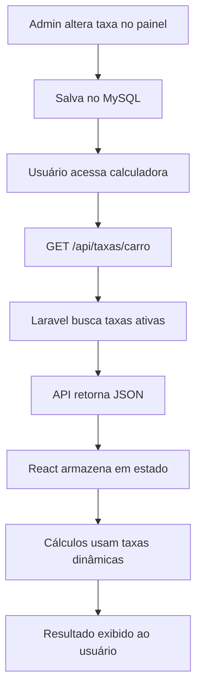

# 🧮 Calculadora de Consórcio vs Financiamento

> Sistema web inteligente para comparação financeira entre consórcio e financiamento de carros e imóveis, com gerenciamento dinâmico de taxas.


---

## 📋 Sobre o Projeto

A **Calculadora de Consórcio vs Financiamento** é uma aplicação web full-stack que permite aos usuários comparar de forma clara e transparente os custos reais entre duas modalidades de aquisição de bens: **consórcio** e **financiamento**.

### 🎯 Problema que Resolve

Muitas pessoas têm dificuldade em entender qual é a melhor opção financeira para adquirir um carro ou imóvel. Esta calculadora:

-   ✅ Compara lado a lado consórcio e financiamento
-   ✅ Calcula custos totais com todas as taxas incluídas
-   ✅ Mostra economias potenciais de forma visual
-   ✅ Ajuda na tomada de decisão financeira consciente
-   ✅ Permite simulações com diferentes cenários

### 🌟 Diferenciais

-   **Sistema de Taxas Dinâmicas**: Administradores podem alterar taxas em tempo real sem precisar modificar código
-   **Interface Moderna**: Design clean e responsivo com componentes reutilizáveis
-   **Comparação Visual**: Gráficos e cards informativos para fácil compreensão
-   **Cálculos Precisos**: Utiliza Sistema Price e todas as taxas aplicáveis ao mercado
-   **Painel Administrativo**: CRUD completo para gerenciamento de taxas

---

## 🚀 Tecnologias

### Backend

-   **[Laravel 12](https://laravel.com/)** - Framework PHP robusto e elegante
-   **[Inertia.js 2](https://inertiajs.com/)** - Ponte entre Laravel e React (SPA sem API)
-   **[Laravel Breeze](https://laravel.com/docs/breeze)** - Autenticação completa
-   **[Laravel Sanctum](https://laravel.com/docs/sanctum)** - Proteção de API
-   **MySQL 8** - Banco de dados relacional

### Frontend

-   **[React 18](https://react.dev/)** - Biblioteca JavaScript para interfaces
-   **[TailwindCSS 3](https://tailwindcss.com/)** - Framework CSS utility-first
-   **[Headless UI](https://headlessui.com/)** - Componentes acessíveis
-   **[Radix UI](https://www.radix-ui.com/)** - Componentes primitivos
-   **[Lucide React](https://lucide.dev/)** - Ícones modernos
-   **[Recharts](https://recharts.org/)** - Gráficos interativos
-   **[html2canvas](https://html2canvas.hertzen.com/)** + **[jsPDF](https://parall.ax/products/jspdf)** - Exportação de resultados em PDF

### Ferramentas de Desenvolvimento

-   **[Vite 7](https://vite.dev/)** - Build tool ultra-rápido
-   **[Laravel Pint](https://laravel.com/docs/pint)** - Code style fixer para PHP
-   **[Axios](https://axios-http.com/)** - Cliente HTTP
-   **[Ziggy](https://github.com/tighten/ziggy)** - Rotas Laravel no JavaScript

---

## ✨ Funcionalidades

### Para Usuários

#### 🧮 Calculadora Inteligente

-   Comparação entre consórcio e financiamento
-   Suporte para carros e imóveis
-   Cálculos em tempo real com debounce
-   Validação inteligente de limites
-   Exportação de resultados em PDF

#### 📊 Visualização de Dados

-   Cards comparativos com economia destacada
-   Gráfico de evolução de parcelas
-   Indicadores visuais de melhor opção
-   Informações detalhadas sobre taxas aplicadas

#### 💡 Informações Contextuais

-   Tooltips explicativos
-   Avisos sobre limites e restrições
-   Badges de taxas atualizadas
-   Comparação de custo total

### Para Administradores

#### 🔧 Painel de Gerenciamento

-   CRUD completo de taxas
-   Ativação/desativação de taxas sem exclusão
-   Organização por tipo de bem (carro/imóvel)
-   Categorização de taxas (consórcio/financiamento/limite)
-   Interface intuitiva e responsiva

#### 📈 Flexibilidade de Negócio

-   Alteração de taxas em 30 segundos
-   Campanhas promocionais rápidas
-   Testes A/B de diferentes cenários
-   Ajustes de mercado em tempo real
-   Sem necessidade de deploy

---

## 📦 Instalação

### Pré-requisitos

Certifique-se de ter instalado:

-   PHP >= 8.2
-   Composer
-   Node.js >= 18
-   MySQL >= 8.0

### Passo a Passo

1. **Clone o repositório**

    ```bash
    git clone https://github.com/seu-usuario/calculadora-laravel.git
    cd calculadora-laravel
    ```

2. **Instale as dependências**

    ```bash
    composer install
    npm install
    ```

3. **Configure o ambiente**

    ```bash
    cp .env.example .env
    php artisan key:generate
    ```

4. **Configure o banco de dados**

    Edite o arquivo `.env`:

    ```env
    DB_CONNECTION=mysql
    DB_HOST=127.0.0.1
    DB_PORT=3306
    DB_DATABASE=calculadora
    DB_USERNAME=root
    DB_PASSWORD=sua_senha
    ```

5. **Execute as migrações e seeders**

    ```bash
    php artisan migrate --seed
    ```

6. **Compile os assets**

    ```bash
    npm run build
    ```

7. **Inicie o servidor**

    ```bash
    composer run dev
    ```

    Este comando executa simultaneamente:

    - Laravel server (http://localhost:8000)
    - Queue worker
    - Log viewer (Pail)
    - Vite dev server (HMR)

### Credenciais Padrão

Após a instalação, você pode fazer login com:

-   **Admin**: `admin@calculadora.com` / `admin123`
-   **Usuário**: `usuario@calculadora.com` / `usuario123`

---

## 🎨 Screenshots

### Calculadora Principal

```
┌────────────────────────────────────────────────────────────┐
│                  🧮 Calculadora Financeira                  │
├────────────────────────────────────────────────────────────┤
│  [Carro] [Imóvel]                                          │
│                                                            │
│  ┌─────────────────────┐  ┌─────────────────────┐        │
│  │    CONSÓRCIO        │  │   FINANCIAMENTO     │        │
│  │                     │  │                     │        │
│  │  Valor do bem       │  │  Valor do bem       │        │
│  │  Lance inicial      │  │  Entrada            │        │
│  │  Prazo              │  │  Prazo              │        │
│  └─────────────────────┘  └─────────────────────┘        │
│                                                            │
│  ┌──────────────────────────────────────────────────────┐ │
│  │  📊 RESULTADO DA COMPARAÇÃO                          │ │
│  │                                                      │ │
│  │  💰 Economia com Consórcio: R$ 12.450,00           │ │
│  │  📈 Você economiza 23,5% escolhendo consórcio       │ │
│  └──────────────────────────────────────────────────────┘ │
└────────────────────────────────────────────────────────────┘
```

### Painel Administrativo

```
┌────────────────────────────────────────────────────────────┐
│  Dashboard > Gerenciar Taxas                               │
├────────────────────────────────────────────────────────────┤
│  [+ Nova Taxa]                         [🔍 Pesquisar...]  │
│                                                            │
│  ┌──────────────────────────────────────────────────────┐ │
│  │ Taxa Administrativa Consórcio Carro    [Ativo] [✏️]  │ │
│  │ 1.2% - Tipo: Carro | Categoria: Consórcio          │ │
│  ├──────────────────────────────────────────────────────┤ │
│  │ Juros Financiamento Carro              [Ativo] [✏️]  │ │
│  │ 12.0% - Tipo: Carro | Categoria: Financiamento     │ │
│  ├──────────────────────────────────────────────────────┤ │
│  │ Taxa Administrativa Consórcio Imóvel   [Ativo] [✏️]  │ │
│  │ 0.8% - Tipo: Imóvel | Categoria: Consórcio         │ │
│  └──────────────────────────────────────────────────────┘ │
└────────────────────────────────────────────────────────────┘
```

---

## 🔧 Estrutura do Projeto

```
calculadora-laravel/
├── app/
│   ├── Http/
│   │   ├── Controllers/       # Controladores da aplicação
│   │   │   ├── TaxaController.php
│   │   │   ├── AdminController.php
│   │   │   └── ...
│   │   └── Middleware/
│   └── Models/
│       ├── Taxa.php           # Model de taxas dinâmicas
│       └── User.php
├── database/
│   ├── migrations/
│   │   └── 2024_01_01_000003_create_taxas_table.php
│   └── seeders/
│       └── TaxaSeeder.php     # Taxas padrão do sistema
├── resources/
│   ├── js/
│   │   ├── Components/        # Componentes React reutilizáveis
│   │   │   ├── FormularioModerno.jsx
│   │   │   ├── CardResultado.jsx
│   │   │   ├── GraficoComparativo.jsx
│   │   │   └── ...
│   │   ├── Pages/             # Páginas Inertia.js
│   │   │   ├── Calculadora/
│   │   │   │   └── Index.jsx
│   │   │   ├── Admin/
│   │   │   │   ├── Taxas/
│   │   │   │   │   ├── Index.jsx
│   │   │   │   │   └── Edit.jsx
│   │   │   └── Auth/
│   │   └── utils/             # Funções utilitárias
│   │       ├── calculations.js   # Lógica de cálculos
│   │       ├── validations.js    # Validações
│   │       └── formatters.js     # Formatação
│   └── css/
│       └── app.css
├── routes/
│   ├── web.php               # Rotas da aplicação
│   └── auth.php              # Rotas de autenticação
├── Docs/                     # Documentação técnica
│   ├── TAXAS_DINAMICAS.md
│   ├── RESUMO_IMPLEMENTACAO_TAXAS_DINAMICAS.md
│   └── ANALISE_ROTAS.md
└── ...
```

---

## 📚 Como Funciona

### Sistema de Taxas Dinâmicas

O grande diferencial do projeto é o **sistema de taxas dinâmicas**:

#### 1. **Armazenamento no Banco**

```sql
CREATE TABLE taxas (
    id BIGINT PRIMARY KEY,
    nome VARCHAR(255),           -- Nome legível
    codigo VARCHAR(255),          -- Identificador único
    valor DECIMAL(10, 4),         -- Valor da taxa
    tipo_bem ENUM('carro', 'imovel'),
    categoria ENUM('consorcio', 'financiamento', 'limite'),
    ativo BOOLEAN,
    created_at TIMESTAMP,
    updated_at TIMESTAMP
);
```

#### 2. **API de Taxas**

```javascript
// Frontend busca taxas ao carregar
useEffect(() => {
    const buscarTaxas = async () => {
        const response = await axios.get(`/api/taxas/${tipoBem}`);
        setConfigTaxas(response.data);
    };
    buscarTaxas();
}, [tipoBem]);
```

#### 3. **Cálculos Dinâmicos**

```javascript
export const calcularConsorcio = (
    valorBem,
    lance,
    prazoMeses,
    tipoBem = "carro",
    configTaxas = null // ← Taxas do banco
) => {
    // Usa taxas dinâmicas ou fallback para estáticas
    const config = configTaxas || getConfig(tipoBem);

    // Todos os cálculos usam 'config'
    const taxaAdmin = (valorBem * config.taxaAdministrativaAnual) / 100;
    // ...
};
```

#### 4. **Benefícios**

-   ⚡ **30 segundos** para alterar taxas (vs 30 minutos editando código)
-   🔒 **Sem riscos** de quebrar o sistema
-   🧪 **Testes rápidos** de diferentes cenários
-   🎯 **Campanhas promocionais** instantâneas
-   🔄 **Ajustes de mercado** em tempo real

### Fluxo de Dados



---

## 🧪 Testes

### Executar Testes

```bash
# Testes unitários e de feature
composer test

# Ou usando artisan
php artisan test
```

### Testar Taxas Dinâmicas

1. **Abra o navegador e pressione F12 (DevTools)**
2. **Vá para aba Network**
3. **Acesse http://localhost:8000**
4. **Observe a requisição `GET /api/taxas/carro`**
5. **Mude para "Imóvel"**
6. **Observe nova requisição `GET /api/taxas/imovel`**

✅ Se aparecerem as requisições = funcionando!

### Testar Alteração de Taxa

1. Acesse a calculadora e anote o resultado
2. Faça login como admin
3. Altere uma taxa (ex: de 1.2% para 3%)
4. Volte para a calculadora
5. Force reload (mude tipo de bem)
6. Observe o novo resultado

✅ Se o valor mudou = taxas dinâmicas funcionando!

---

## 📊 Taxas Cadastradas

### Consórcio - Carro

| Taxa                | Valor | Aplicação         |
| ------------------- | ----- | ----------------- |
| Taxa Administrativa | 1.2%  | `valorBem × 1.2%` |
| Comissão            | 1.5%  | `valorBem × 1.5%` |

### Consórcio - Imóvel

| Taxa                | Valor | Aplicação         |
| ------------------- | ----- | ----------------- |
| Taxa Administrativa | 0.8%  | `valorBem × 0.8%` |
| Comissão            | 2.0%  | `valorBem × 2.0%` |

### Financiamento - Carro

| Taxa          | Valor  | Aplicação                 |
| ------------- | ------ | ------------------------- |
| Juros         | 12%    | Sistema Price (anual)     |
| Seguro        | 0.4%   | `valorBem × 0.4%` (anual) |
| Licenciamento | R$ 200 | Valor fixo por ano        |

### Financiamento - Imóvel

| Taxa      | Valor | Aplicação                 |
| --------- | ----- | ------------------------- |
| Juros     | 9%    | Sistema Price (anual)     |
| Seguro    | 0.3%  | `valorBem × 0.3%` (anual) |
| Avaliação | 0.5%  | `valorBem × 0.5%` (único) |
| ITBI      | 3%    | `valorBem × 3%` (único)   |

---

## 🤝 Contribuindo

Contribuições são bem-vindas! Para contribuir:

1. Faça um fork do projeto
2. Crie uma branch para sua feature (`git checkout -b feature/AmazingFeature`)
3. Commit suas mudanças (`git commit -m 'Add: nova funcionalidade incrível'`)
4. Push para a branch (`git push origin feature/AmazingFeature`)
5. Abra um Pull Request

### Padrões de Commit

-   `Add:` Nova funcionalidade
-   `Fix:` Correção de bug
-   `Update:` Atualização de funcionalidade
-   `Remove:` Remoção de código
-   `Refactor:` Refatoração de código
-   `Docs:` Atualização de documentação

---

## 📝 Documentação Adicional

O projeto conta com documentação técnica detalhada na pasta `Docs/`:

-   **[TAXAS_DINAMICAS.md](./Docs/TAXAS_DINAMICAS.md)** - Guia completo do sistema de taxas
-   **[RESUMO_IMPLEMENTACAO_TAXAS_DINAMICAS.md](./Docs/RESUMO_IMPLEMENTACAO_TAXAS_DINAMICAS.md)** - Resumo da implementação
-   **[ANALISE_ROTAS.md](./Docs/ANALISE_ROTAS.md)** - Fluxo de autenticação e rotas
-   **[GUIA_INSTALACAO_COMPLETO.md](./Docs/GUIA_INSTALACAO_COMPLETO.md)** - Instalação detalhada

---

## 🔒 Segurança

-   ✅ Autenticação via Laravel Breeze
-   ✅ Proteção de rotas com middleware
-   ✅ Validação de dados no backend e frontend
-   ✅ Proteção CSRF em todas as requisições
-   ✅ Sanitização de inputs
-   ✅ Fallback automático para taxas estáticas

### Reportar Vulnerabilidades

Se encontrar alguma vulnerabilidade de segurança, por favor envie um email para: seu-email@exemplo.com

---

## 📈 Performance

-   ⚡ **< 50ms** - Tempo de resposta da API de taxas
-   🚀 **HMR** - Hot Module Replacement com Vite
-   💾 **Lazy Loading** - Componentes carregados sob demanda
-   ⏱️ **Debounce** - 500ms nos cálculos para evitar processamento desnecessário
-   🎯 **Otimização** - Build minificado para produção

---

## 🛣️ Roadmap

### Implementado ✅

-   [x] Sistema de taxas dinâmicas
-   [x] Comparação consórcio vs financiamento
-   [x] Suporte para carros e imóveis
-   [x] Painel administrativo
-   [x] Exportação para PDF
-   [x] Gráficos interativos
-   [x] Design responsivo

### Próximos Passos 🚧

-   [ ] Sistema de notificações por email
-   [ ] Histórico de simulações (usuários logados)
-   [ ] Comparação de múltiplas ofertas
-   [ ] API pública para integrações
-   [ ] Dashboard analítico para admin
-   [ ] Testes automatizados (unit + integration)
-   [ ] Modo escuro
-   [ ] PWA (Progressive Web App)

---

## 📄 Licença

Este projeto está sob a licença MIT. Veja o arquivo [LICENSE](LICENSE) para mais detalhes.

---

## 👨‍💻 Autor

**Seu Nome**

-   GitHub: [@seu-usuario](https://github.com/seu-usuario)
-   LinkedIn: [seu-perfil](https://linkedin.com/in/seu-perfil)
-   Email: seu-email@exemplo.com

---

## 🙏 Agradecimentos

-   [Laravel](https://laravel.com/) - Framework PHP incrível
-   [React](https://react.dev/) - Biblioteca JavaScript poderosa
-   [Inertia.js](https://inertiajs.com/) - Ponte perfeita entre backend e frontend
-   [TailwindCSS](https://tailwindcss.com/) - Framework CSS que acelera o desenvolvimento
-   [Comunidade Open Source](https://github.com/) - Por todas as bibliotecas utilizadas

---

<div align="center">

**⭐ Se este projeto foi útil, considere dar uma estrela!**

[🐛 Reportar Bug](https://github.com/seu-usuario/calculadora-laravel/issues) ·
[✨ Solicitar Feature](https://github.com/seu-usuario/calculadora-laravel/issues) ·
[📖 Documentação](./Docs)

</div>

---

<div align="center">
  <sub>Desenvolvido com 💚 para ajudar pessoas a tomarem decisões financeiras melhores</sub>
</div>
